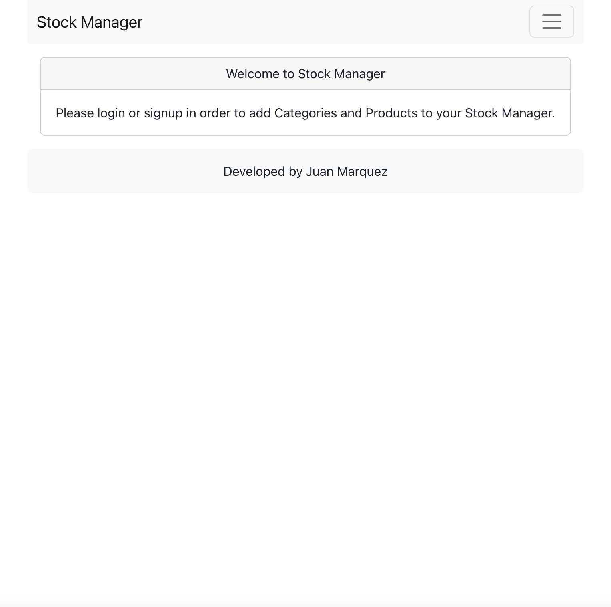

# stock-manager

## CONTENTS

[1. DESCRIPTION](#DESCRIPTION)

[2. SCREENSHOTS](#SCREENSHOTS)

[3. INSTALLATION](#INSTALLATION)

[4. USAGE](#USAGE)

[5. TECHNOLOGIES USED](#TECHNOLOGIESUSED)

[6. CONTRIBUTE](#CONTRIBUTE)

[7. TESTS](#TESTS)

[8. LICENCE](#LICENCE)

[9. COLLABORATORS](#COLLABORATORS)

## DESCRIPTION

## SCREENSHOTS

"

## INSTALLATION

 

## USAGE

## TECHNOLOGIES USED

## CONTRIBUTE

    No contributions accepted

## TESTS

    No tests created

## LICENCE

    Unlicenced

## COLLABORATORS

[Juan's Profile](https://github.com/juanmarquez4)  
