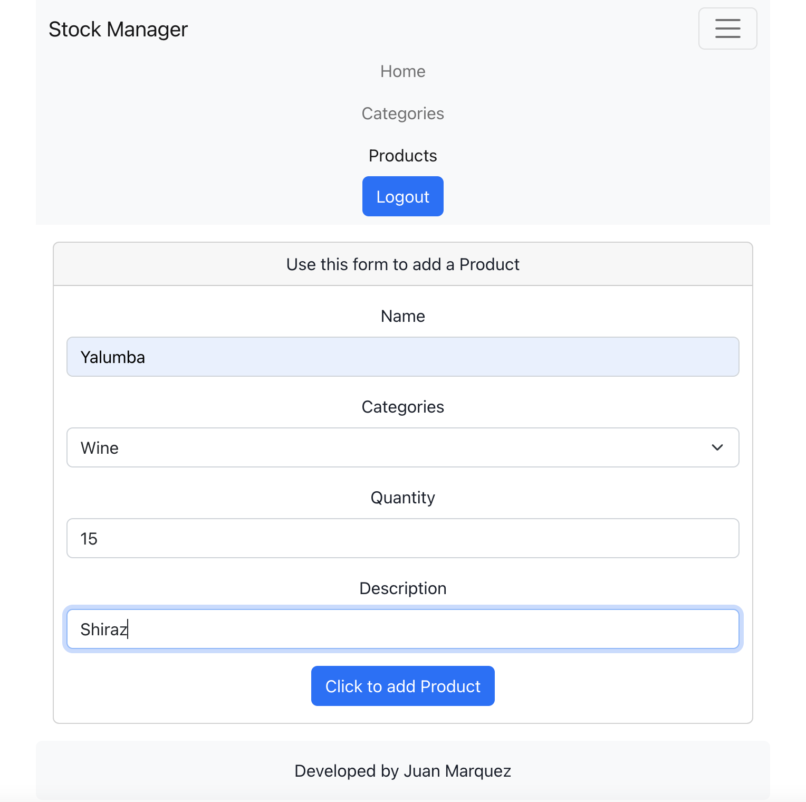

# stock-manager

## CONTENTS

[1. DESCRIPTION](#DESCRIPTION)

[2. SCREENSHOTS](#SCREENSHOTS)

[3. INSTALLATION](#INSTALLATION)

[4. USAGE](#USAGE)

[5. TECHNOLOGIES USED](#TECHNOLOGIESUSED)

[6. CONTRIBUTE](#CONTRIBUTE)

[7. TESTS](#TESTS)

[8. LICENCE](#LICENCE)

[9. COLLABORATORS](#COLLABORATORS)

## DESCRIPTION

    Manage your business stock in a convinient way with Stock Manager React app.

## SCREENSHOTS

## INSTALLATION

    In your project folder, run the following commands:
     git clone git@github.com:juanmarquez4/stock-manager.git
     cd stock-manager

    Create a file called .env in the server folder, and set the following vars:
     MONGODB_URI="yourMongoDBLink"
     SECRET="yourSecretKey"

    Run the following command:
     npm install

## USAGE

    Run the following command:
     npm run start: to initialize back end
     or
     npm run develop

## TECHNOLOGIES USED
 
    REACT
    HTML
    CSS
    JAVASCRIPT
    NODE.JS
    EXPRESS.JS
    MONGODB/MONGOOSE
    BOOTSTRAP

## CONTRIBUTE

    No contributions accepted

## TESTS

    No tests created

## LICENCE

    Unlicenced

## COLLABORATORS

[Juan's Profile](https://github.com/juanmarquez4)  
